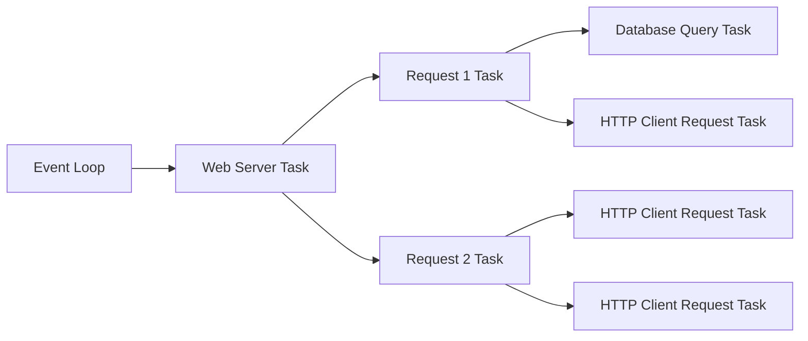
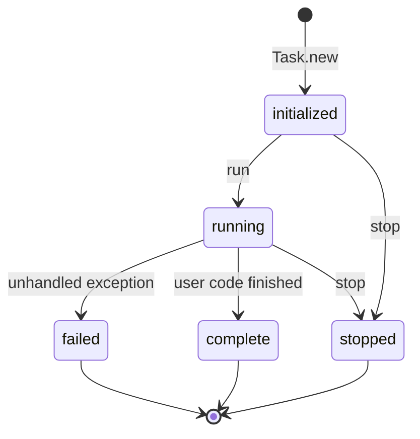
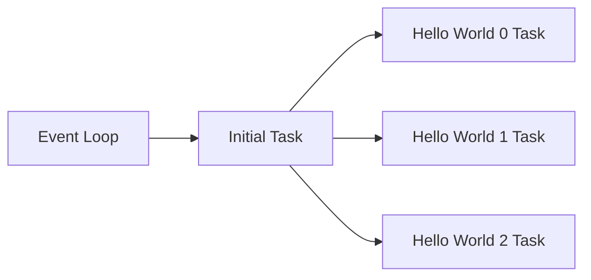

# Asynchronous Tasks

This guide explains how asynchronous tasks work and how to use them.

## Overview

Tasks are the smallest unit of sequential code execution in {ruby Async}. Tasks can create other tasks, and Async tracks the parent-child relationship between tasks. When stopping a parent task, it will also stop all it's children tasks. The event loop generally has one root task.



## Task Lifecycle

Tasks represent units of work which are executed according to the following state transition diagram:



Tasks are created in the initialized state, and are run by the event loop. During the execution, a task can either complete successfully, fail with an unhandled exception, or be explicitly stopped. In all of these cases, you can wait for a task to complete by using {ruby Async::Task#wait}.

1. In the case the task successfully completed, the result will be whatever value was generated by the last expression in the task.
2. In the case the task failed with an unhandled exception, waiting on the task will re-raise the exception.
3. In the case the task was stopped, the result will be `nil`.

## Starting A Task

At any point in your program, you can start a task using the {ruby Kernel::Async} method:

```ruby
Async do
	3.times do |i|
		sleep 1
		puts "Hello World #{i}"
	end
end
```

This program prints "Hello World" 3 times. Before printing, it sleeps for 1 second. The total execution time is 3 seconds because the program executes sequentially.

By using a nested task, we can ensure that each iteration of the loop creates a new task which runs concurrently.

```ruby
Async do
	3.times do |i|
		Async do
			sleep 1
			puts "Hello World #{i}"
		end
	end
end
```

Instead of taking 3 seconds, this program takes 1 second in total. The main loop executes rapidly creating 3 child tasks, and then each child task sleeps for 1 second before printing "Hello World".



By constructing your program correctly, it's easy to implement concurrent map-reduce:

```ruby
Async do
	# Map (create several concurrent tasks)
	users_size = Async{User.size}
	posts_size = Async{Post.size}
	
	# Reduce (wait for and merge the results)
	average = posts_size.wait / users_size.wait
	puts "#{users_size.wait} users created #{ruby Average} posts on average."
end
```

### Performance Considerations

Task creation and execution has been heavily optimised. Do not trade program complexity to avoid creating tasks, the cost will almost never be useful.

Do consider using correct concurrency primatives like {ruby Async::Semaphore}, {ruby Async::Barrier}, etc, to ensure your program is well-behaved in the presence of large inputs (i.e. don't create an unbounded number of tasks).

## Starting a Limited Number of Tasks

When processing potentially unbounded data, you may want to limit the concurrency using {ruby Async::Semaphore}.

```ruby
Async do
	# Create a semaphore with a limit of 2:
	semaphore = Async::Semaphore.new(2)
	
	file.each_line do |line|
		semaphore.async do
			# Only two tasks at most will be allowed to execute concurrently:
			process(line)
		end
	end
end
```

## Waiting for Tasks

Waiting for a single task is trivial, simply invoke {ruby Async::Task#wait}. To wait for multiple tasks, you may want to use a {ruby Async::Barrier}. You can use {ruby Async::Barrier#async} to create multiple child tasks, and wait for them all to complete using {ruby Async::Barrier#wait}.

```ruby
barrier = Async::Barrier.new

Async do
	jobs.each do |job|
		barrier.async do
			# ... process job ...
		end
	end
	
	# Wait for all jobs to complete:
	barrier.wait
end
```

### Waiting for the First N Tasks

Occasionally, you may need to just wait for the first task (or first several tasks) to complete. You can use a combination of {ruby Async::LimitedBarrier} and {ruby Async::Barrier} for controlling this:

```ruby
barrier = Async::Barrier.new(parent: barrier)

Async do
	jobs.each do |job|
		barrier.async do
			# ... process job ...
		end
	end
	
	# Wait for the first two jobs to complete:
	done = barrier.wait(2)
end
```

### Combining a Barrier with a Semaphore

{ruby Async::Barrier} and {ruby Async::Semaphore} are designed to be compatible with each other, and with other tasks that nest `#async` invocations. There are other similar situations where you may want to pass in a parent task, e.g. {ruby Async::IO::Endpoint#bind}.

~~~ ruby
barrier = Async::Barrier.new
semaphore = Async::Semaphore.new(2, parent: barrier)

jobs.each do |job|
	semaphore.async(parent: barrier) do
		# ... process job ...
	end
end

# Wait until all jobs are done:
barrier.wait
~~~

## Stopping a Task

When a task completes execution, it will enter

There are various situations where you may want to stop a task ({ruby Async::Task#stop}). The most common case is shutting down a server, but other important situations exist, e.g. you may fan out multiple (10s, 100s) of requests, wait for a subset to complete (e.g. the first 5 or all those that complete within a given deadline), and then stop (terminate/cancel) the remaining operations.

Using the above program as an example, we can 

```ruby
Async do
	tasks = 3.times.map do |i|
		Async do
			sleep 1
			puts "Hello World #{i}"
		end
	end
	
	# Stop all the above tasks:
	tasks.each(&:stop)
end
```

### Stopping all Tasks held in a Barrier

To stop (terminate/cancel) the all tasks held in a barrier:

```ruby
barrier = Async::Barrier.new

Async do
	tasks = 3.times.map do |i|
		barrier.async do
			sleep 1
			puts "Hello World #{i}"
		end
	end
	
	barrier.stop
end
```

If you're letting individual tasks held by a barrier throw unhandled exceptions, be sure to call ({ruby Async::Barrier#stop}):

```ruby
barrier = Async::Barrier.new

Async do
	tasks = 3.times.map do |i|
		barrier.async do
			sleep 1
			puts "Hello World #{i}"
		end
	end
	
	begin
		barrier.wait
	ensure
		barrier.stop
	end
end
```

## Resource Management

In order to ensure your resources are cleaned up correctly, make sure you wrap resources appropriately, e.g.:

~~~ ruby
Async do
	begin
		socket = connect(remote_address) # May raise Async::Stop

		socket.write(...) # May raise Async::Stop
		socket.read(...) # May raise Async::Stop
	ensure
		socket.close if socket
	end
end
~~~

As tasks run synchronously until they yield back to the reactor, you can guarantee this model works correctly. While in theory `IO#autoclose` allows you to automatically close file descriptors when they go out of scope via the GC, it may produce unpredictable behavour (exhaustion of file descriptors, flushing data at odd times), so it's not recommended.

## Exception Handling

{ruby Async::Task} captures and logs exceptions. All unhandled exceptions will cause the enclosing task to enter the `:failed` state. Non-`StandardError` exceptions are re-raised immediately and will generally cause the reactor to fail. This ensures that exceptions will always be visible and cause the program to fail appropriately.

~~~ ruby
require 'async'

task = Async do
	# Exception will be logged and task will be failed.
	raise "Boom"
end

puts task.status # failed
puts task.wait # raises RuntimeError: Boom
~~~

### Propagating Exceptions

If a task has finished due to an exception, calling `Task#wait` will re-raise the exception.

~~~ ruby
require 'async'

Async do
	task = Async do
		raise "Boom"
	end
	
	begin
		task.wait # Re-raises above exception.
	rescue
		puts "It went #{$!}!"
	end
end
~~~

## Timeouts

You can wrap asynchronous operations in a timeout. This ensures that malicious services don't cause your code to block indefinitely.

~~~ ruby
require 'async'

Async do |task|
	task.with_timeout(1) do
		task.sleep 100
	rescue Async::TimeoutError
		puts "I timed out!"
	end
end
~~~

### Reoccurring Timers

Sometimes you need to do some periodic work in a loop.

~~~ ruby
require 'async'

Async do |task|
	while true
		puts Time.now
		task.sleep 1
	end
end
~~~

## Reactor Lifecycle

Generally, the event loop will not exit until all tasks complete. This is informed by {ruby Async::Task#finished?} which checks if the current node has completed execution, which also includes all children. However, there is one exception to this rule: tasks flagged as being transient ({ruby Async::Node#transient?}).

### Transient Tasks

Tasks which are flagged as transient, do not behave like normal tasks.

```ruby
@pruner = Async(transient: true) do
	while true
		sleep 1
		prune_connection_pool
	end
end
```

1. They will not keep the reactor alive, and instead are stopped (with a {ruby Async::Stop} exception) when all other (non-transient) tasks are finished.
2. If the parent task is finished, any transient tasks will become children of the parent's parent, i.e. they don't keep sub-trees alive.
3. If you stop a task which has transient children, those transient children will not be stopped and will instead move up the tree.

The purpose of transient tasks is when a task is an implementation detail of an object or instance, rather than a concurrency process. Some examples of trasient tasks 

- A task which is reading or writing data on behalf of a stateful connection object, e.g. HTTP/2 frame reader, Redis cache invalidation, etc.
- A task which is monitoring and maintaining a connection pool, pruning unused connections or possibly ensuring those connections are periodically checked for activity (ping/pong, etc).
- A background worker or batch processing job which is independent of any specific operation, and is lazily created.
- A cache system which needs periodic expiration / revalidation of data/values.

Bearing in mind, in all of the above cases, you may need to validate that the background task hasn't been stopped, e.g.

```ruby
require 'async'
require 'thread/local' # thread-local gem.

class TimeCache
	extend Thread::Local
	
	def initialize
		@current_time = nil
	end
	
	def current_time
		refresh!
		
		return @current_time
	end
	
	private def refresh!
		@refresh ||= Async(transient: true) do
			while true
				@current_time = Time.now.to_s
				sleep(1)
			end
		ensure
			# When the reactor terminates all tasks, this will be invoked:
			@refresh = nil
		end
	end
end

Async do
	# If you are handling 1000s of requests per second, it can be an advantage to cache the current time as a string.
	p TimeCache.instance.current_time
end
```

Upon existing the top level async block, the {ruby @refresh} task will be set to `nil`. Bear in mind, you should not share these resources across threads, doing so would need further locking/coordination.
