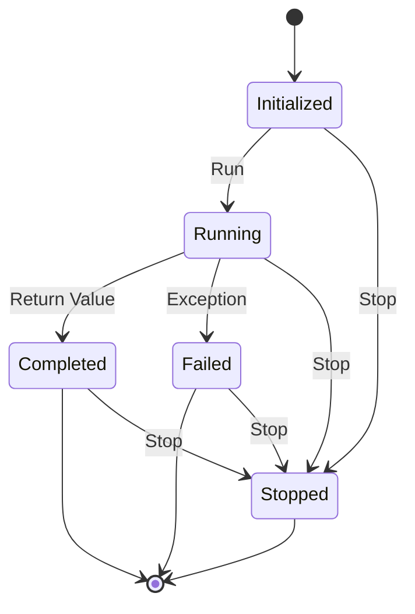

A sequence of instructions, defined by a block, which is executed sequentially and managed by the scheduler. A task can be in one of the following states: `initialized`, `running`, `completed`, `failed`, `cancelled` or `stopped`.



## Example

```ruby
require 'async'

# Create an asynchronous task that sleeps for 1 second:
Async do |task|
	sleep(1)
end
```
