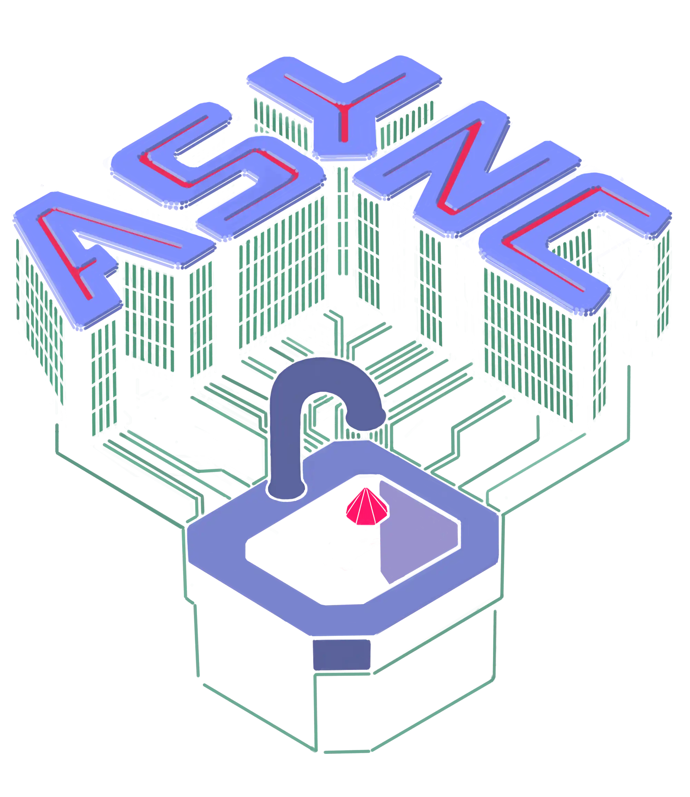

# 

Async is a composable asynchronous I/O framework for Ruby based on [io-event](https://github.com/socketry/io-event).

> "Lately I've been looking into `async`, as one of my projects –
> [tus-ruby-server](https://github.com/janko/tus-ruby-server) – would really benefit from non-blocking I/O. It's really
> beautifully designed." *– [janko](https://github.com/janko)*

## Features

  - Scalable event-driven I/O for Ruby. Thousands of clients per process\!
  - Light weight fiber-based concurrency. No need for callbacks\!
  - Multi-thread/process containers for parallelism.
  - Growing eco-system of event-driven components.

## Usage

Please see the [project documentation](https://socketry.github.io/async/) for more details.

  - [Getting Started](https://socketry.github.io/async/guides/getting-started/index) - This guide shows how to add async to your project and run code asynchronously.

  - [Scheduler](https://socketry.github.io/async/guides/scheduler/index) - This guide gives an overview of how the scheduler is implemented.

  - [Tasks](https://socketry.github.io/async/guides/tasks/index) - This guide explains how asynchronous tasks work and how to use them.

  - [Best Practices](https://socketry.github.io/async/guides/best-practices/index) - This guide gives an overview of best practices for using Async.

  - [Debugging](https://socketry.github.io/async/guides/debugging/index) - This guide explains how to debug issues with programs that use Async.

  - [Thread safety](https://socketry.github.io/async/guides/thread-safety/index) - This guide explains thread safety in Ruby, focusing on fibers and threads, common pitfalls, and best practices to avoid problems like data corruption, race conditions, and deadlocks.

## Releases

Please see the [project releases](https://socketry.github.io/async/releases/index) for all releases.

### v2.27.4

  - Suppress excessive warning in `Async::Scheduler#async`.

### v2.27.3

  - Ensure trace attributes are strings, fixes integration with OpenTelemetry.

### v2.27.2

  - Fix `context/index.yaml` schema.

### v2.27.1

  - Updated documentation and agent context.

### v2.27.0

  - `Async::Task#stop` supports an optional `cause:` argument (that defaults to `$!`), which allows you to specify the cause (exception) for stopping the task.
  - Add thread-safety agent context.

### v2.26.0

  - `Async::Notification#signal` now returns `true` if a task was signaled, `false` otherwise, providing better feedback for notification operations.
  - `require "async/limited_queue"` is required to use `Async::LimitedQueue` without a deprecation warning. `Async::LimitedQueue` is not deprecated, but it's usage via `async/queue` is deprecated.
  - `Async::Task#sleep` is deprecated with no replacement.
  - `Async::Task.yield` is deprecated with no replacement.
  - `Async::Scheduler#async` is deprecated, use `Async{}`, `Sync{}` or `Async::Task#async` instead.
  - Agent context is now available, via the [`agent-context` gem](https://github.com/ioquatix/agent-context).
  - [`Async::Barrier` Improvements](https://socketry.github.io/async/releases/index#async::barrier-improvements)
  - [Introduce `Async::Queue#close`](https://socketry.github.io/async/releases/index#introduce-async::queue#close)

### v2.25.0

  - Added support for `io_select` hook in the fiber scheduler, allowing non-blocking `IO.select` operations. This enables better integration with code that uses `IO.select` for multiplexing IO operations.
  - [Use `IO::Event::WorkerPool` for Blocking Operations](https://socketry.github.io/async/releases/index#use-io::event::workerpool-for-blocking-operations)
  - [Better handling of `IO#close` using `fiber_interrupt`](https://socketry.github.io/async/releases/index#better-handling-of-io#close-using-fiber_interrupt)

### v2.24.0

  - Ruby v3.1 support is dropped.
  - `Async::Wrapper` which was previously deprecated, is now removed.
  - [Flexible Timeouts](https://socketry.github.io/async/releases/index#flexible-timeouts)

### v2.23.0

  - Rename `ASYNC_SCHEDULER_DEFAULT_WORKER_POOL` to `ASYNC_SCHEDULER_WORKER_POOL`.
  - [Fiber Stall Profiler](https://socketry.github.io/async/releases/index#fiber-stall-profiler)

### v2.21.1

  - [Worker Pool](https://socketry.github.io/async/releases/index#worker-pool)

## See Also

  - [async-http](https://github.com/socketry/async-http) — Asynchronous HTTP client/server.
  - [async-websocket](https://github.com/socketry/async-websocket) — Asynchronous client and server websockets.
  - [async-dns](https://github.com/socketry/async-dns) — Asynchronous DNS resolver and server.
  - [falcon](https://github.com/socketry/falcon) — A rack compatible server built on top of `async-http`.
  - [rubydns](https://github.com/ioquatix/rubydns) — An easy to use Ruby DNS server.
  - [slack-ruby-bot](https://github.com/slack-ruby/slack-ruby-bot) — A client for making slack bots.

## Contributing

We welcome contributions to this project.

1.  Fork it.
2.  Create your feature branch (`git checkout -b my-new-feature`).
3.  Commit your changes (`git commit -am 'Add some feature'`).
4.  Push to the branch (`git push origin my-new-feature`).
5.  Create new Pull Request.

### Developer Certificate of Origin

In order to protect users of this project, we require all contributors to comply with the [Developer Certificate of Origin](https://developercertificate.org/). This ensures that all contributions are properly licensed and attributed.

### Community Guidelines

This project is best served by a collaborative and respectful environment. Treat each other professionally, respect differing viewpoints, and engage constructively. Harassment, discrimination, or harmful behavior is not tolerated. Communicate clearly, listen actively, and support one another. If any issues arise, please inform the project maintainers.
