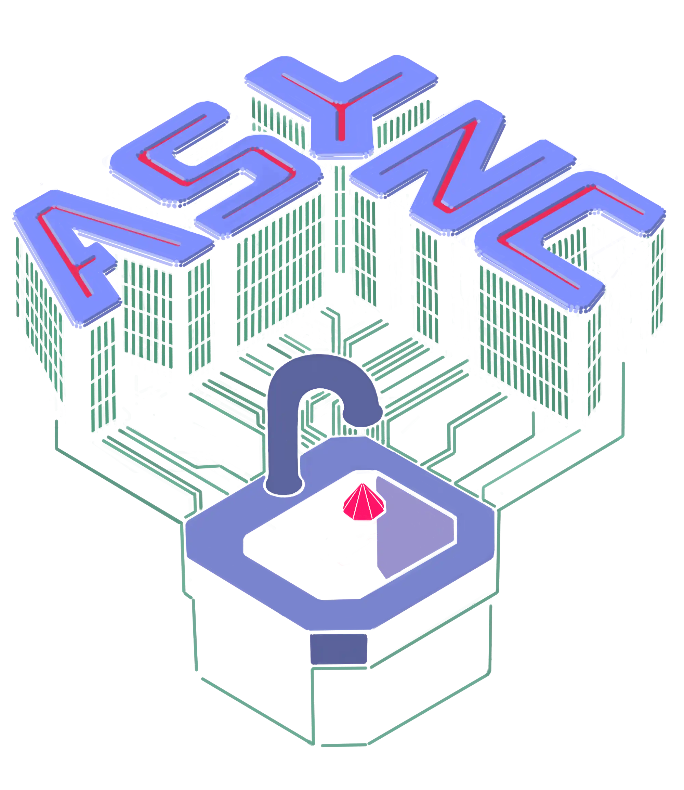

# 

Async is a composable asynchronous I/O framework for Ruby based on [io-event](https://github.com/socketry/io-event).

> "Lately I've been looking into `async`, as one of my projects –
> [tus-ruby-server](https://github.com/janko/tus-ruby-server) – would really benefit from non-blocking I/O. It's really
> beautifully designed." *– [janko](https://github.com/janko)*

[](https://github.com/socketry/async/actions?workflow=Test)

## Features

  - Scalable event-driven I/O for Ruby. Thousands of clients per process\!
  - Light weight fiber-based concurrency. No need for callbacks\!
  - Multi-thread/process containers for parallelism.
  - Growing eco-system of event-driven components.

## Usage

Please see the [project documentation](https://socketry.github.io/async/) for more details.

  - [Getting Started](https://socketry.github.io/async/guides/getting-started/index) - This guide shows how to add async to your project and run code asynchronously.

  - [Scheduler](https://socketry.github.io/async/guides/scheduler/index) - This guide gives an overview of how the scheduler is implemented.

  - [Tasks](https://socketry.github.io/async/guides/tasks/index) - This guide explains how asynchronous tasks work and how to use them.

  - [Best Practices](https://socketry.github.io/async/guides/best-practices/index) - This guide gives an overview of best practices for using Async.

  - [Debugging](https://socketry.github.io/async/guides/debugging/index) - This guide explains how to debug issues with programs that use Async.

  - [Thread safety](https://socketry.github.io/async/guides/thread-safety/index) - This guide explains thread safety in Ruby, focusing on fibers and threads, common pitfalls, and best practices to avoid problems like data corruption, race conditions, and deadlocks.

## Releases

Please see the [project releases](https://socketry.github.io/async/releases/index) for all releases.

### v2.43.0

  - Propagate cancellation causes through task trees so child tasks observe the original cancellation cause.

### v2.42.0

  - `Sync` and `Async` can now be invoked from a non-blocking fiber that has no scheduler (e.g. inside an `Enumerator` or a bare `Fiber.new`). Previously this raised `RuntimeError: Running scheduler on non-blocking fiber!`. The reactor is now run within `Fiber.blocking`, so the scheduler always runs on a blocking fiber.

### v2.41.0

  - **Fixed**: Protect initial task from Interrupt exceptions.

### v2.40.0

  - Introduce `Async::Condition#waiting_count`. This allows you to see how many tasks are currently waiting on the condition, which can be useful for debugging and monitoring purposes.

### v2.39.0

  - `Async::Barrier#wait` now returns the number of tasks that were waited for, or `nil` if there were no tasks to wait for. This provides better feedback about the operation, and allows you to know how many tasks were involved in the wait.

### v2.38.1

  - Fix `Barrier#async` when `parent.async` yields before the child block executes. Previously, `Barrier#wait` could return early and miss tracking the task entirely, because the task had not yet appended itself to the barrier's task list.

### v2.38.0

  - Rename `Task#stop` to `Task#cancel` for better clarity and consistency with common concurrency terminology. The old `stop` method is still available as an alias for backward compatibility, but it is recommended to use `cancel` going forward.
  - Forward arguments from `Task#wait` -\> `Promise#wait`, so `task.wait(timeout: N)` is supported.

### v2.37.0

  - Introduce `Async::Loop` for robust, time-aligned loops.
  - Add support for `Async::Promise#wait(timeout: N)`.

### v2.36.0

  - Introduce `Task#wait_all` which recursively waits for all children and self, excepting the current task.
  - Introduce `Task#join` as an alias for `Task#wait` for compatibility with `Thread#join` and similar interfaces.

### v2.35.3

  - `Async::Clock` now implements `#as_json` and `#to_json` for nicer log formatting.

## See Also

  - [async-http](https://github.com/socketry/async-http) — Asynchronous HTTP client/server.
  - [falcon](https://github.com/socketry/falcon) — A rack compatible server built on top of `async-http`.
  - [async-websocket](https://github.com/socketry/async-websocket) — Asynchronous client and server websockets.
  - [async-dns](https://github.com/socketry/async-dns) — Asynchronous DNS resolver and server.
  - [toolbox](https://github.com/socketry/toolbox) — GDB & LLDB extensions for debugging Ruby applications with Fibers.

## Contributing

We welcome contributions to this project.

1.  Fork it.
2.  Create your feature branch (`git checkout -b my-new-feature`).
3.  Commit your changes (`git commit -am 'Add some feature'`).
4.  Push to the branch (`git push origin my-new-feature`).
5.  Create new Pull Request.

### Running Tests

To run the test suite:

``` shell
bundle exec sus
```

### Making Releases

To make a new release:

``` shell
bundle exec bake gem:release:patch # or minor or major
```

### Developer Certificate of Origin

In order to protect users of this project, we require all contributors to comply with the [Developer Certificate of Origin](https://developercertificate.org/). This ensures that all contributions are properly licensed and attributed.

### Community Guidelines

This project is best served by a collaborative and respectful environment. Treat each other professionally, respect differing viewpoints, and engage constructively. Harassment, discrimination, or harmful behavior is not tolerated. Communicate clearly, listen actively, and support one another. If any issues arise, please inform the project maintainers.
